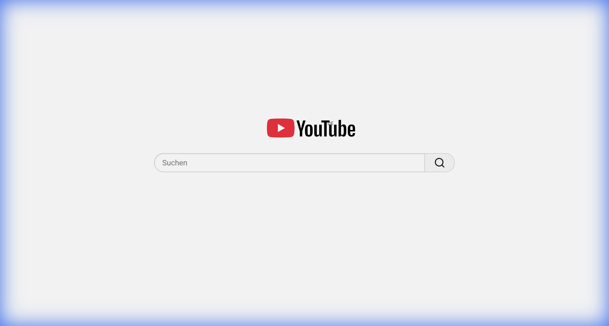

# CleanYouTube

CleanYouTube is a lightweight Userscript that transforms YouTube into a distraction-free environment. It removes the algorithmic feed, hides Shorts, cleans up the search interface, and centers the content for a focused viewing experience.

## Features

- **Minimalist Homepage**: Replaces the chaotic feed with a clean, centered search bar and logo – just like Google Search.
- **Focused Search Results**: Displays video results without clutter, removing shorts shelves, chips, and sidebar distractions.
- **Distraction-Free Channels**: Hides sidebars and recommendation lists on channel pages to keep the focus on the creator's content.
- **Shorts Blocker**: Completely removes YouTube Shorts from the homepage, search results, and navigation menus.
- **Privacy First**: No tracking, no external calls. Just pure CSS and JS modifications.

## Installation

Since this is a specific Userscript, you need a Userscript manager for your browser.

1. Install the **Tampermonkey** browser extension (available for Chrome, Firefox, Edge, Safari).
2. **[Click here to install the script](https://raw.githubusercontent.com/lukas-hzb/CleanYouTube/main/clean_youtube.user.js)**.
3. Tampermonkey will ask if you want to add the script. Confirm by clicking "Install".
4. Open YouTube – the clean interface should appear automatically.

## Screenshots

| Clean Homepage |
| :---: |
|  |
